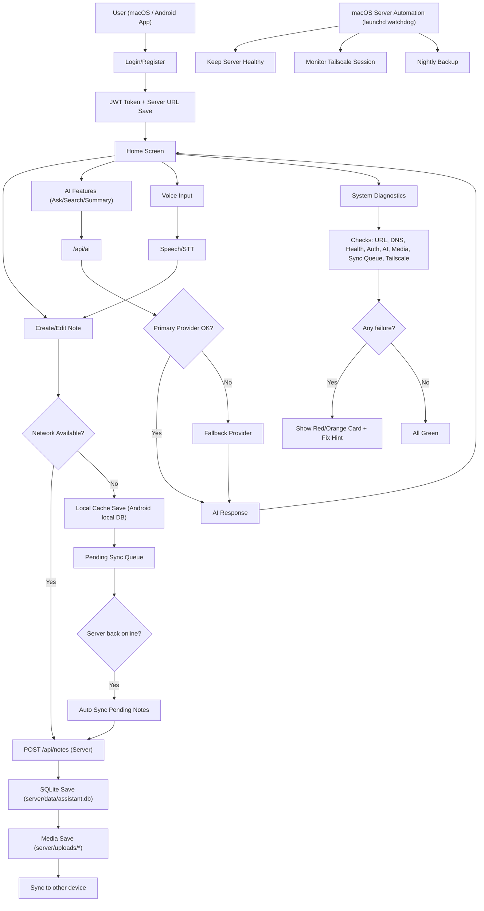

# App Pipeline Flow

This flow explains how the app works end-to-end (macOS + Android + server + sync + AI).

```mermaid
flowchart TD
    A["User (macOS / Android App)"] --> B["Login/Register"]
    B --> C["JWT Token + Server URL Save"]
    C --> D["Home Screen"]

    D --> E["Create/Edit Note"]
    E --> F{"Network Available?"}

    F -- "Yes" --> G["POST /api/notes (Server)"]
    G --> H["SQLite Save (server/data/assistant.db)"]
    H --> I["Media Save (server/uploads/*)"]
    I --> J["Sync to other device"]

    F -- "No" --> K["Local Cache Save (Android local DB)"]
    K --> L["Pending Sync Queue"]
    L --> M{"Server back online?"}
    M -- "Yes" --> N["Auto Sync Pending Notes"]
    N --> G

    D --> O["AI Features (Ask/Search/Summary)"]
    O --> P["/api/ai"]
    P --> Q{"Primary Provider OK?"}
    Q -- "Yes" --> R["AI Response"]
    Q -- "No" --> S["Fallback Provider"]
    S --> R
    R --> D

    D --> T["Voice Input"]
    T --> U["Speech/STT"]
    U --> E

    D --> V["System Diagnostics"]
    V --> W["Checks: URL, DNS, Health, Auth, AI, Media, Sync Queue, Tailscale"]
    W --> X{"Any failure?"}
    X -- "Yes" --> Y["Show Red/Orange Card + Fix Hint"]
    X -- "No" --> Z["All Green"]

    AA["macOS Server Automation (launchd watchdog)"] --> AB["Keep Server Healthy"]
    AA --> AC["Monitor Tailscale Session"]
    AA --> AD["Nightly Backup"]
```

